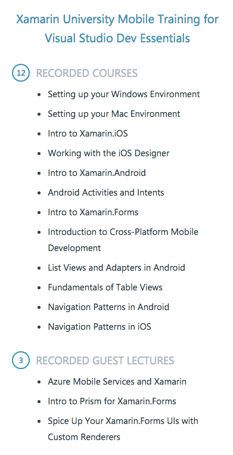

What is Visual Studio Dev Essentials?
-------------------------------------

Visual Studio Dev Essentials is a bundle of tools, cloud services and training provided for free by Microsoft for every developer with a Microsoft Account.

With this bundle, you get access to Visual Studio Community - the full IDE that works on Windows, to Visual Studio Code - cross platform text editor that works across Windows, macOS and Linux, full access to the Microsoft Azure Cloud Services for a full year up to $ 25 every month and **free** access to Pluralsight or Xamarin University (among other free training providers such as Microsoft Virtual Academy).

How to activate Dev Essentials?
-------------------------------

First of all, you need a Microsoft Account. You can [follow the instructions here](https://support.microsoft.com/en-gb/instantanswers/d18cc497-d839-cf50-dea8-f99c95f2bd16/sign-up-for-a-microsoft-account) in order to create your account.

After you create your account and sign up for the Visual Studio Dev Essentials program, you should be able to see all your benefits:

At this point, you can download Visual Studio or Visual Studio Code, depending on what you plan to develop and on your operating system.

Activating the Cloud benefits - Azure
-------------------------------------

In order to start using your free cloud benefits, you need to follow the steps in the portal and provide all necessary contact details and information.

> Note that at some point in creating your cloud account, a credit card is required. This step only ensures that you don't create multiple cloud accounts and **will not make any payments from your credit card**.

After your account is successfully activated, you can [go to the Azure Portal](https://portal.azure.com) and see something very similar to this:

Pluralsight
-----------

From the same Dev Essentials portal you can activate a 3 months subscription to Pluralsight (which normally is $ 29 monthly).

Just enter your account details and you are good to go. 

> On Pluralsight you can find more than 4500 courses oriented for developers and IT professionals and is the one of the first destinations for developer traning.

Xamarin University
------------------
Xamarin is the a (now) Microsoft technology that allows you to create cross-platform mobile applications for iOS, Android and Windows 10 with a very high rate of code reusability.

They also provide traning and courses, and through the Dev Essentials program you can access 12 recorded courses on how to develop apps using Xamarin.

Conclusion
----------

This is how you can get free access a lot of developer focused technologies, services and traning from Microsoft.