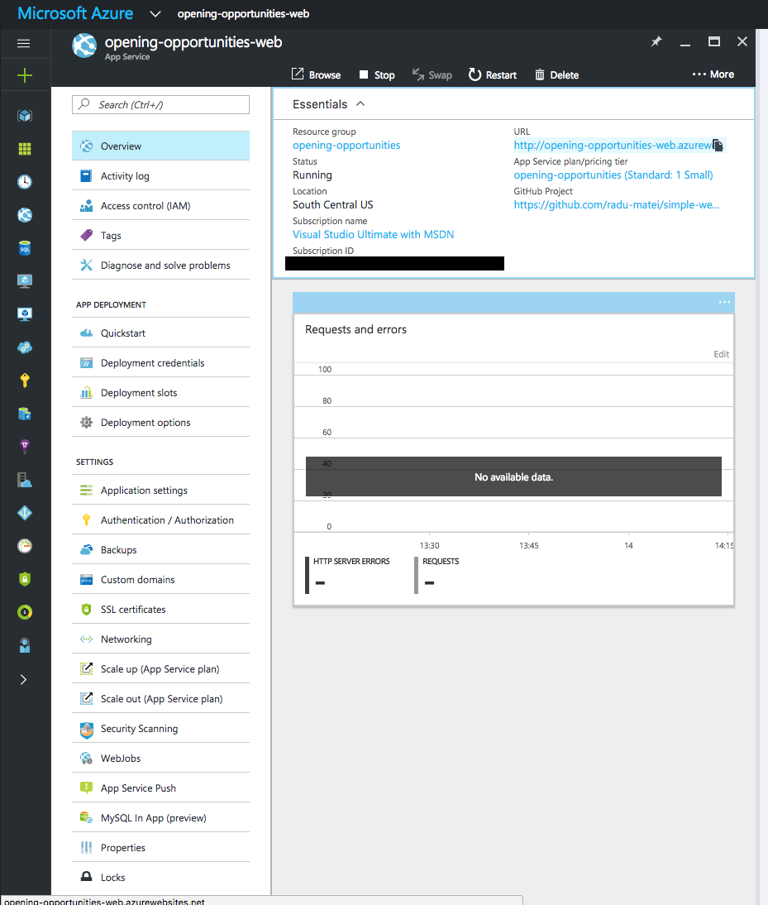
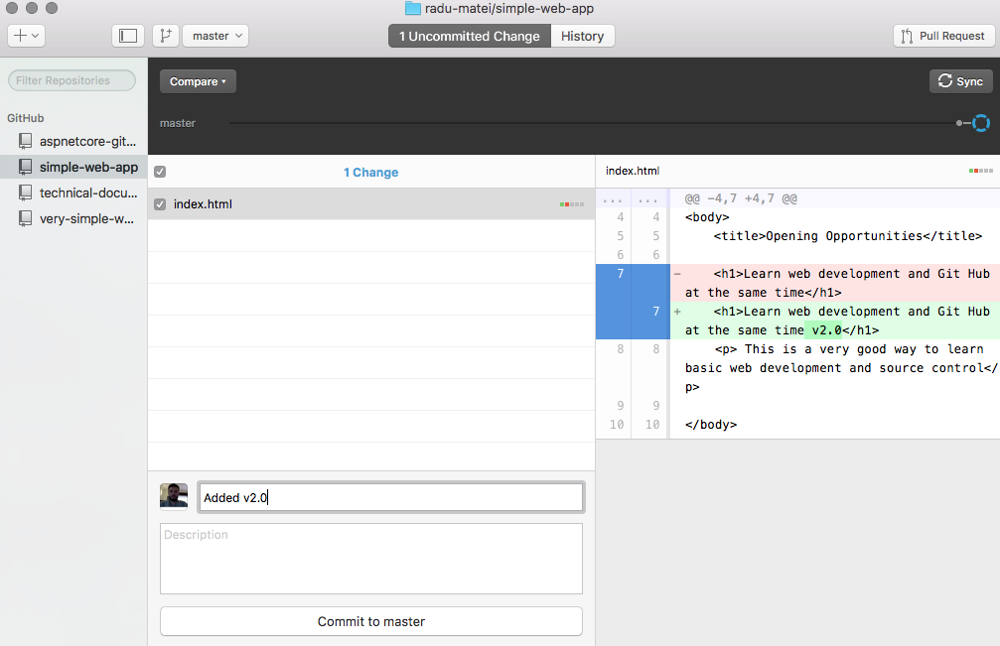

Website, GitHub, Azure
----------------------

In this article we will create a very simple website, create a GitHub repository for it and publish it publicly on the web using Microsoft Azure.

Everytime we will update the application through commits in the GitHub repository, the website will automatically update and the latest version will be automatically published.

In order to follow this article, you need to [activate the Visual Studio Dev Essentials benefits by following the instructions here](https://github.com/awesome-opening-opportunities/technical-documentation/blob/master/docs/vs-dev-essentials.md).

Creating the GitHub repository
-------------------------------

> To get started with version control, you can follow the [Pluralsight course on GitHub for Windows Develoeprs(https://app.pluralsight.com/library/courses/github-windows-developers/table-of-contents).

First of all, you need to create a GitHub account by providing a username, an email and a password.


After this, we are ready to create a new repository that will host the source code of our website. On your GitHub page, find the `New Repository` button and fill in the relavant information:


At this point, you created your repository but there is no code yet.


> There are multiple ways to interact with a Git repository, but for the moment we will use the GitHub Desktop application which is available both for Windows and macOS.

> [Download and install GitHub Desktop from this page](https://desktop.github.com/).


After installing GitHub Desktop, on the page of your repository you can press the `Set up in Desktop` button which will open the GitHub Desktop application with your repository.


Adding some code
----------------

> The code editor we will use is Visual Studio Code. You can [install VS Code from this page](https://code.visualstudio.com).

We will add a very simple HTML page and we will commit the changes on the remote repository.

First of all, we need to open the project folder with VS Code.


We will create a single HTML page, named `index.html`.

> Any name for the page will work, but after we create the web application on the cloud we will understand why this naming convention.


Now we can add some code to our application:

```
<!DOCTYPE html>
<html>

<body>
	<title>Opening Opportunities</title>

	<h1>Learn web development and Git Hub at the same time</h1>
    <p> This is a very good way to learn basic web development and source control</p>

</body>

</html>
```

> We will not discuss the elements of the HTML page here, as this is not the purpose of this article.

> To get started with web technologies (HTML, JavaScript and CSS) there are multiple Pluralsight and Microsoft Virtual Academy courses you can follow.

In order to check your web page locally, you can drag and drop the HTML file in your browser. It should look similar to this:


When we are happy with our web page, we can commit the changes so we can see them on the GitHub website:


> At this point, the commit is still local. We need to `Push` the changes so they are available publicly.

> Right now you can revert the changes if you made a mistake, as the changes are not yet synced with the remote stream.

In order to push the changes, we need to hit the `Publish` button in GitHub Desktop, and after a little while the changes should be visible.


Creating a web application in Azure
-----------------------------------

GitHub is a very good way for teams to collaborate on projects, but you can only see the source code of the application. Our goal is for everybody to access our website.

To do this, we will create a new web application in the Azure Portal: New --> Web + Mobile --> Web App.


Add the name of your website, a resource group and a service plan, which are only some logical ways of grouping multiple projects (we will not get into specific Azure details at this point, we only want our website up and running).

> Note that this has to be globally unique, and the name you select will be part of the domain.

> Example: If you pick the `abc` name, then you will access the website from: `abc.azurewebsites.net`.

After the deployment is ready, we can find the new website on our Azure Portal Dashboard.

Linking the GitHub project in Azure
-----------------------------------

In the Website options, search for `Deployment Options` and configure GitHub as the deployment source. You will need to sign in with your GitHub account and authorize Azure to access your repositories.


After you sign in, you should be able to choose your project as the source of the website and hit OK. 


Normally, this step cloned the GitHub repository and you should be able to access the website.



In this case, my application was named `opening-opportunities-web`, so I should be able to go to `http://opening-opportunities-web.azurewebsites.net/` and see the same page that I saw when I opened the local website:


Making changes to the website
-----------------------------
At this point, we can commit changes to our repository and we will see the changes live in our application without us doing anything.




Conclusion
----------

This is how we can get started with a simple website with the source code in GitHub and the live application on Azure.